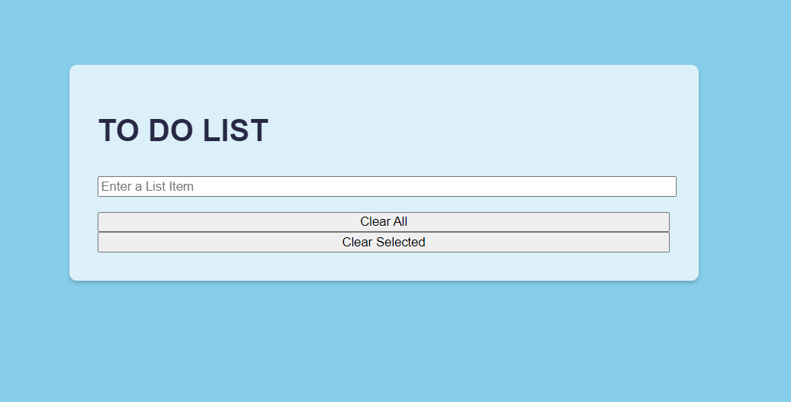
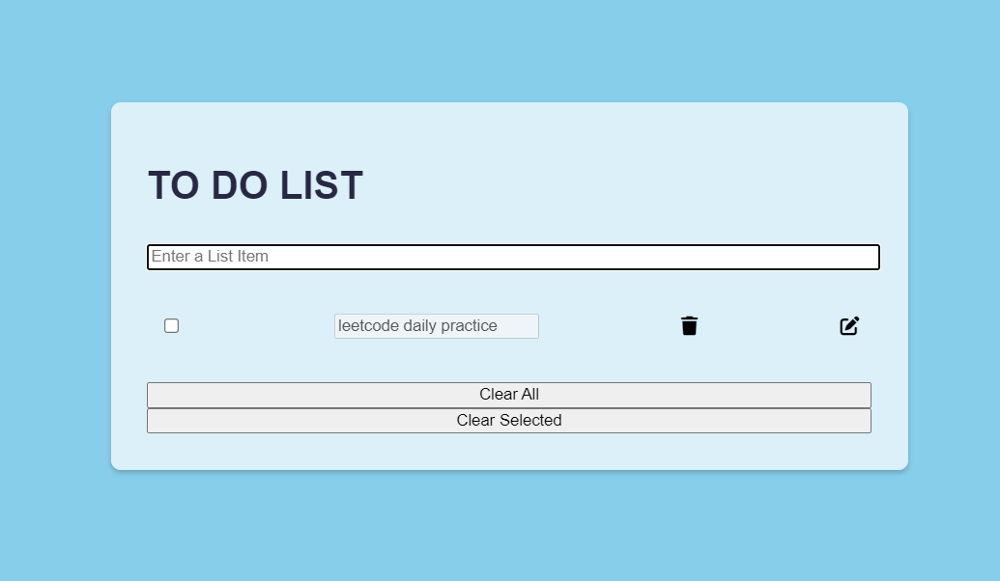
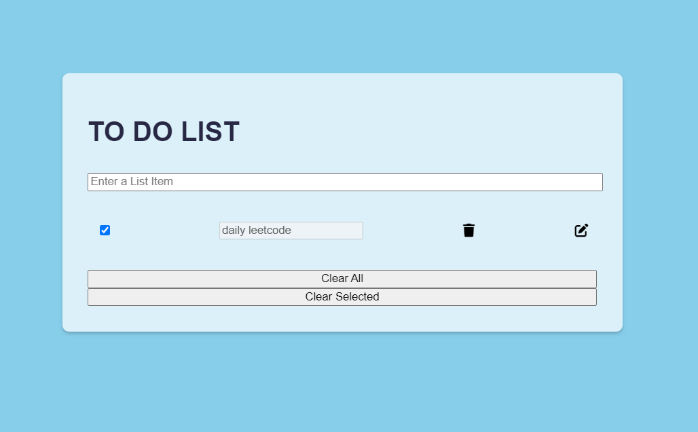

# Todo List Web Application

The Todo List Web Application is a simple and intuitive task management tool built with HTML, CSS, and JavaScript. It allows users to organize and track their daily tasks effectively.

## Features

- Add new tasks
- Edit task descriptions
- Mark tasks as completed
- Delete tasks
- Toggle all tasks
- Responsive design

## Getting Started

To use the Todo List Web Application, simply open the `to-do-list.html` file in your web browser. No additional installations or dependencies are required.

## Screenshots

You can find below some screenshots of the Todo List Web Application:

### Adding a Task

### Editing a Task

## Contributing

Contributions are welcome! If you have any ideas, improvements, or bug fixes, please open an issue or submit a pull request.

## License

This project is licensed under the [MIT License](LICENSE).

